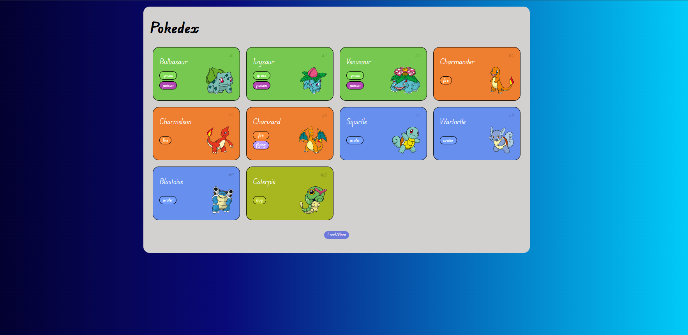

# 🌟 Pokédex Interativa



Uma Pokédex interativa que consome dados da [PokéAPI](https://pokeapi.co/) e exibe os primeiros Pokémon de forma visual e organizada. Feita com HTML, CSS e JavaScript puro.

## 🔥 Funcionalidades

- ✅ Consumo da PokéAPI.
- 🎨 Estilo moderno e responsivo com CSS.
- 🧭 Organização por tipo de Pokémon com cores distintas.
- 📲 Layout adaptado para diferentes tamanhos de tela.
- 🔄 Botão de “Load More” para carregar mais Pokémon sob demanda.

## 🚀 Tecnologias Utilizadas

- HTML5
- CSS3
- JavaScript (vanilla)
- [PokéAPI](https://pokeapi.co/)

## 📂 Estrutura do Projeto

```
/pokedex
├── index.html
├── style.css
├── script.js
└── README.md
```

## 📸 Exemplo de Uso

Ao acessar a página, o usuário verá os primeiros Pokémon listados, com suas imagens, tipos e numeração. Cada tipo tem uma cor de fundo personalizada. Clicando em "Load More", novos Pokémon são carregados dinamicamente da API.


